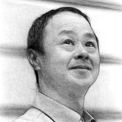

# Shiro Matsumoto

I'm a data science consultant based in Washington D.C., with 25 years of experience in a consulting company. 

Possessing over 25 years of expertise in data analysis (DA), data science (DS), and machine learning (ML) as a senior researcher at Mitsubishi Research Institute, Tokyo. 

Demonstrated ability in DA, DS, and ML, marketing science (marketing research using quantitative analysis and economics, mainly on big data), and project planning, implementation, analysis, and reporting. 

As an experienced data analyst and data scientist, possess extensive skills in all aspects of DA and DS projects with structured and unstructured data, including statistical hypothesis testing, multivariate analysis, visualization, model building, and evaluation. 

As a qualified consultant, executed some projects simultaneously and have proven experience in tackling complex issues on DA and DS many times.

## 📧 Contact information

[LinkedIn](https://www.linkedin.com/in/srmtmt/)

[Medium](https://medium.com/@shrmtmt)

[Facebook (In Japanese)](https://www.facebook.com/shiromatz)

[Twitter (In Japanese)](https://twitter.com/shrmtmt)

## 👔 **CAREER SUMMARY**

### **Data Science and Machine Learning**

- Led demand forecasting projects using ML in railroad and food distribution companies. For the railroad company, optimized ticket types allocation to each train, which resulted in an increase in annual sales by hundreds of millions of dollars. For the food distributor, reduced inventory and decreased shortages simultaneously resulted in tens of millions of dollars in increased sales and cost savings.
- Invented a model involving deep learning (DL) and natural language processing (NLP) that predicted employability from an applicant’s resume in corporate recruiting and provided the core logic for a hiring support service offered by a human resource advertising company. Before my work, the partner company had the second-largest market share in the industry in Japan before offering core logic. After my work, it became the largest market share in Japan.
- Built a model with DL and NLP that predicts the days it will take for imported goods brought to an international logistics container yard to be removed from the container yard, thereby streamlining work at the container yard and reducing costs.
- Developed a solution with DL to read the number of boxes, barcodes, and expiration dates at once from an image of items stacked in layers on a pallet. In order to read all this information simultaneously, it was necessary to process ultra-high pixel images, but DL was not good at handling ultra-high pixel images. By properly separating and combining processing at the edge device with the camera and the cloud server, we could meet the required latency and accuracy of information needed. This solution reduced the human resources and costs associated with incoming inspection.
- Designed and applied an ML model to the screening operations of a guarantee company. The company has improved the quality and equality, and speed of operations of screening that were previously performed manually.

### **Data Analysis for Marketing Science**

- Designed, conducted, and analyzed an international internet survey using marketing science methods to support the decision-making of chief engineers at a global automaker in planning new vehicles. Product planning for new cars is more critical than product planning for other consumer goods because it takes more than three years (at a considerable cost) to plan, design, prepare for mass production, and launch the product. My work helped to reduce costs by reducing the number of grades while better satisfying consumer needs. To avoid cannibalization with their other products and encourage conversion from other companies, my work used the utility theory of economics and various multivariate analysis methods to find the optimal positioning of the new product scientifically and rationally.
- Planned and executed an econometric and marketing science analysis of POS (Point of Sales) data and weather data that revealed price elasticities and cross-elasticities for an international beverage manufacturer and improved pricing strategies to an unprecedented level.

### **Data Management for Business Planning and Implementation**

- Provide companion consulting services to credit card companies, including training on analyzing customer and usage data, statistical causal inference, and deriving insights to transform themselves into companies that can realize data-driven marketing.
- Led the smooth start-up of a newly established company by taking the lead in designing business, service, and operation with designing, planning, and building internal systems, including databases.

---

## 🏛 EXPERIENCE

- Independent Consultant, Washington D.C. & Tokyo **2022-**
- Senior Researcher
Business Digital Transformation Division, Digital Transformation Unit	
Mitsubishi Research Institute, Tokyo **2010-2022**
- Researcher
Marketing Strategy Group, Industry and Market Strategy Research Division	
Mitsubishi Research Institute, Tokyo **2002-2010**
- Assistant Manager
Business Management Division	
Houseplus Housing Warranty Corporation (secondment) **1999-2002**
- Junior Researcher
Industrial Strategy Research Dept., Corporate Management Division	
Mitsubishi Research Institute, Tokyo **1997-1999**

---

## 🛠 Skills

- Python, R, JavaScript, SQL (SPSS, Fortran in the past)
- Machine Learning with structured and unstructured data (tabular, image, natural language)
- Data visualization with R shiny, Power BI, Tableau, etc.
- Statistics, statistical hypothesis testing, multivariate analysis, statistical causal inference
- Cloud technology (AWS, Azure), ML engineering for production (MLOps), Microsoft Office (including VBA)

---

## 📜 Certificates
Some are written under my original family name, "Oinuma (老沼)". 
- [“Deep Learning for ENGINEER” of Japan Deep Learning Association](https://www.openbadge-global.com/ns/portal/openbadge/public/assertions/detail/Yk82YUtSaHoybUdoSG54K3pnVjNCZz09)
- [“TensorFlow Developer Certificate” of Google TensorFlow](https://www.credential.net/3a9b86c9-a62e-4d49-bc5a-815a082b4c3d#gs.wm0d6e)
- ["Machine Learning Engineering for Production (MLOps)" Coursera](https://www.coursera.org/account/accomplishments/specialization/certificate/7XFA7YUYRY52)
- "Software Design & Development Engineer" [IPA](https://www.ipa.go.jp/en/index.html)
- "Senior Systems Administrator" [IPA](https://www.ipa.go.jp/en/index.html)

---

## 🧠 Patents (As an employee invention)

- 
- 
- 

---

## 🗣 Languages

### Japanese

Native speaker 

### English

Proficient speaker 

---

## 🏫 Education

### **Master of Science**

Division of Earth and Planetary Sciences, Kyoto University, March 1997
